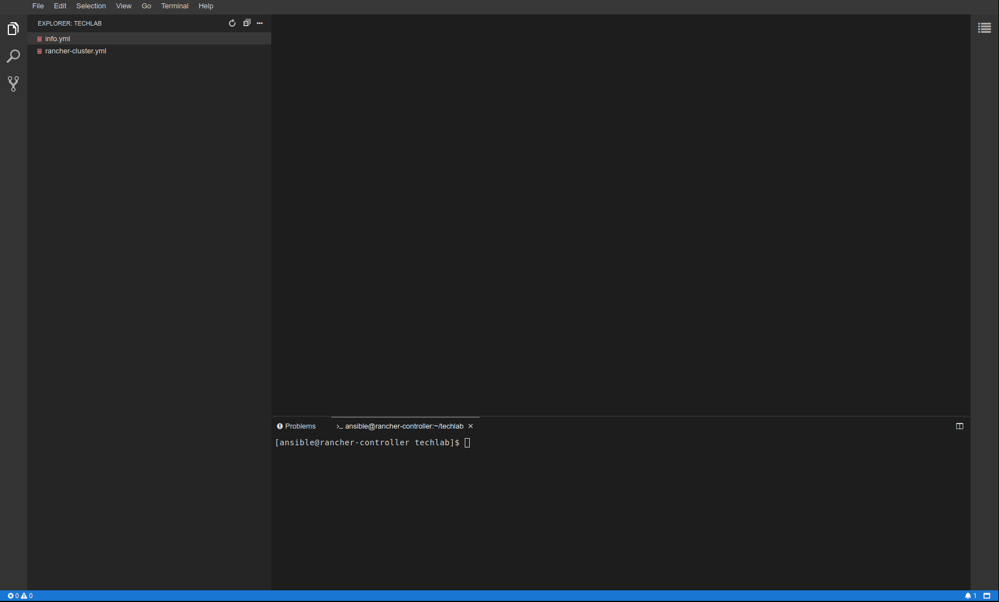

## Lab 1.1: Architectural Overview

### Overview
The figure below illustrates the high-level architecture of Rancher 2.x. The figure depicts a Rancher Server installation that manages two Kubernetes clusters: one created by Rancher Kubernetes Engine (RKE) and another created by Amazon EKS (Elastic Kubernetes Service).

Check https://rancher.com/docs/rancher/v2.x/en/overview/architecture/ for more details.

### Lab Setup
In this lab we are going to install Rancher based on the [High Availability (HA) install](https://rancher.com/docs/rancher/v2.x/en/installation/ha/) Guide.

For this we need 3 VMs for Rancher and 3 VMs for a Kubernetes Cluster we want to provision. There is a LoadBalancer VM, which will redirect all request to the 3 Rancher Node. There is also a Controller VM, on which you will perform all the commands.
So your lab enviornments looks like this

* VM: userX-controller
* VM: userX-lb
* VM: userX-rancher[1-3]
* VM: userX-k8snode[1-3]

Open `https://[IP-of-userX-controller].xip.puzzle.ch` in your browser and login via the given credentials. You can use this browser-based IDE (based on [theia](https://theia-ide.org/) in which you have access to the folder & files on the controller node. You can also open a terminal with a `bash` console and use it to connect to your other vm's via ssh. Check `info.yml` for all the IP's and DNS Names of your host.

Make sure you can login into all of the VMs. On the controller node there is a SSH Private/Public Key pair in `/home/ansible/.ssh/id_rsa` which allowes to to ssh into all the other vm's. All the VMs are provisioned on [cloudscale.ch](https://www.cloudscale.ch/) and are based on CentOS 7.

---

**End of Lab 1.1**

<a href="12_hostpreparation.md">1.2 Host Preparation →</a>

[← back to the Chapter Overview](10_rancher.md)
