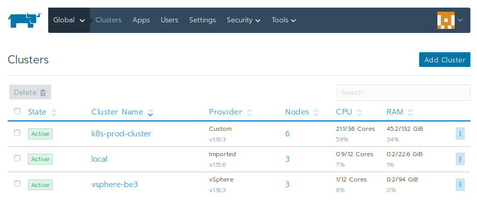
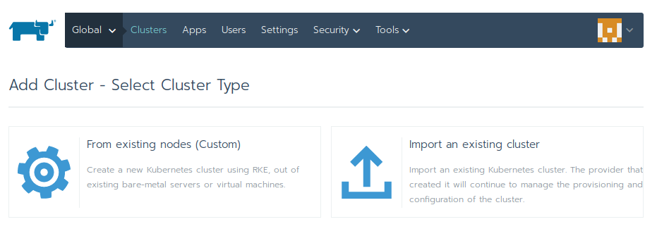
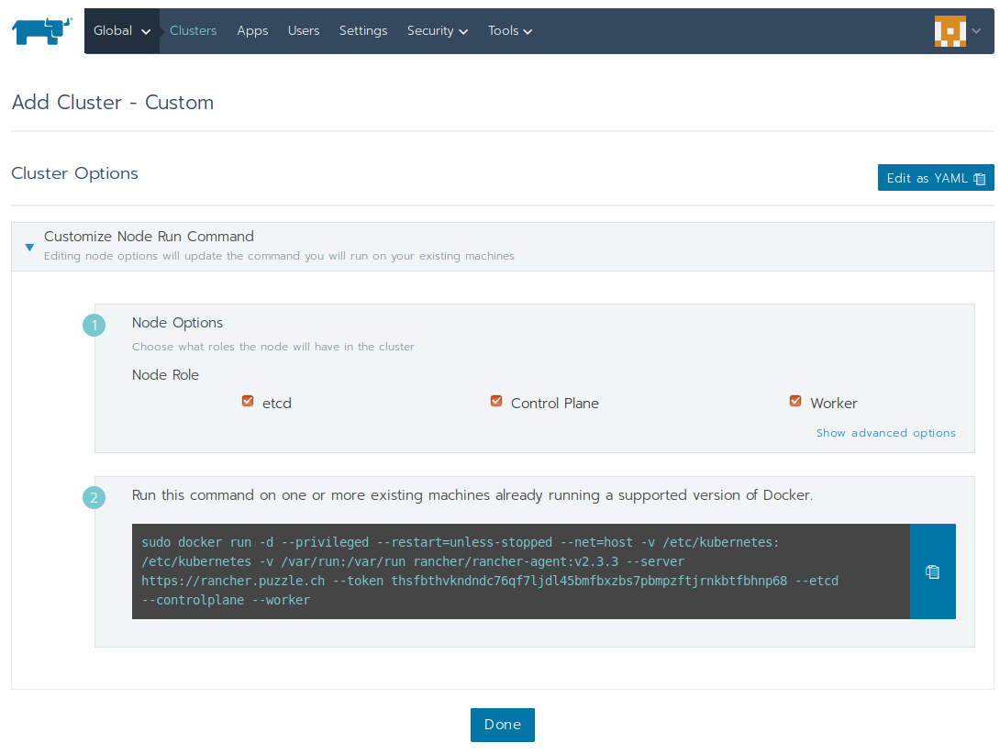
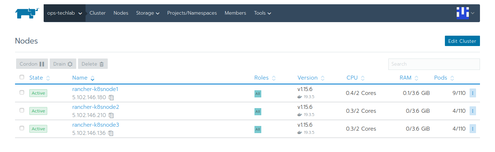

## Lab 2.1: Provision a new Kubernetes cluster

In this lab we are going to provision a new [Custom Cluster](https://rancher.com/docs/rancher/v2.x/en/cluster-provisioning/custom-clusters/) managed by the previously installed Rancher Control Plane

### Add Cluster

Open your Rancher Control Plane on the Global / Cluster Page

Click on `Add Cluster` and select `From existing nodes (Custom)`

Specify a name for your cluster: `ops-techlab`.

In the `Cluster Options` / `Kubernetes Options` choose version `v1.17.9` (as we want to upgrade later). Leave all the other options on default.

Click on the `Next` Button. 

Select all Node Roles, as for this ops-techlab we are not going to use dedicated master nodes.

You can now use the `sudo docker run...` command to add your nodes to the Kubernetes Cluster.

Login into your `userX-k8snode[1-2]` VMs and execute the docker command on each VM. Don't add `userX-k8snode3` yet, as we wanna add this node later.

Then click on the `Done` Button. 

Your cluster is now beeing provisioned. Observe the Messages show in the Rancher Control Plane and wait until you cluster is fully ready. This will take some minutes.

**End of Lab 2.1**

<a href="22_lifecyclerancher.md"> Lifecycle Kubernetes Cluster →</a>

[← back to the Chapter Overview](10_rancher.md)
