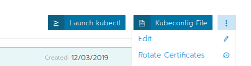
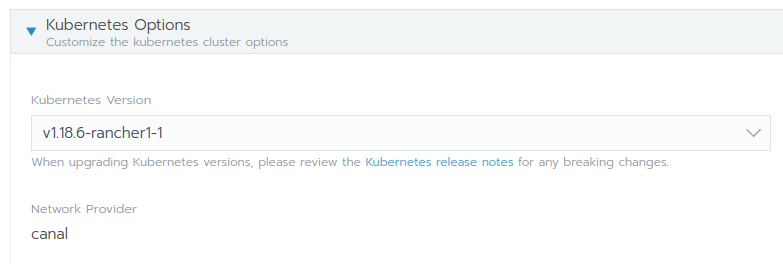
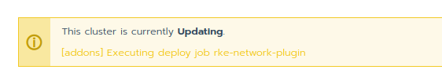

## Lab 2.2: Lifecycle Kubernetes Cluster

In this lab we are going to upgrade our recently created kubernetes cluster to a newer kubernetes version. See also the official [documentation](https://rancher.com/docs/rancher/v2.x/en/cluster-admin/upgrading-kubernetes/) from Rancher.

## Upgrade Cluster

Go to your cluster dashboard inside the Rancher web gui and edit the cluster

From there, in the cluster options / kubernetes options select the new kubernetes version you want to upgrade to and then save

Rancher does start the upgrade process and will replace all the kubernetes componets with the updated version.

**Note:** with version 2.3 of Rancher you do not have control over the upgrade process. Rancher does upgrade all master components and then then the the worker nodes. Therefore an upgrade is not guaranteed to have zero downtime. On the [Roadmap of Rancher 2.4](https://github.com/rancher/rancher/wiki/Rancher-2.4) this behaviour should be improved.

**Note:** Upgrade a kubernetes version can also lead to upgrade of addons like CNI, DNS etc. Always check release notes and the [System Images](https://rancher.com/docs/rke/latest/en/config-options/system-images/) page or better [k8s_rke_system_images.go](https://github.com/rancher/kontainer-driver-metadata/blob/master/rke/k8s_rke_system_images.go) for details.

Wait again, until you cluster update is done.

**End of Lab 2.2**

<a href="30_dailybusiness.md"> Daily Business →</a>

[← back to the Chapter Overview](10_rancher.md)
