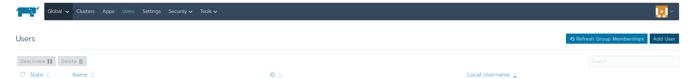
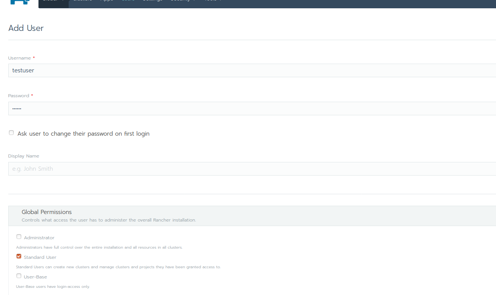
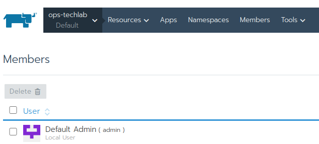
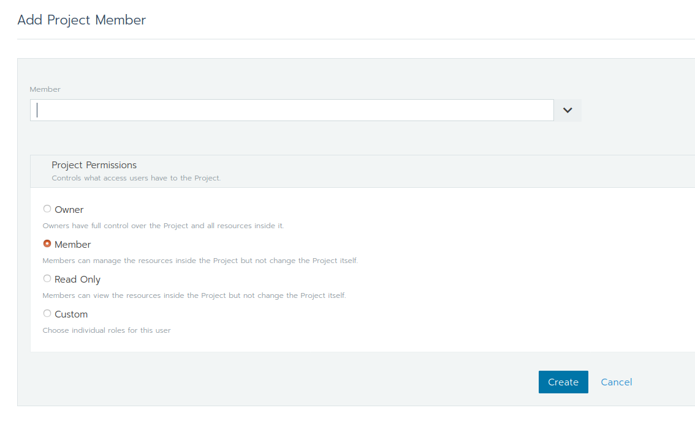

## Lab 3.2: User Management

Rancher relies on users and groups to determine who is allowed to log in to Rancher and which resources they can access. When you configure an external authentication provider, users from that provider will be able to log in to your Rancher server. When a user logs in, the authentication provider will supply your Rancher server with a list of groups to which the user belongs.

### Adding local users

Inside your Rancher Web Gui, on page `Users` in the global view, click on `Add User`. Set a username and password. 

The user shall be a "Standard user", later, we are going to assign this user to a project.

Click `Create`.

### Grant access to a project inside your cluster

We are now going to assign the newly created user to a project inside your Kubernetes cluster. From the dropdown, hover over your cluster and then select a project (e.g. default). Change to the `Members` tab.

Click on `Add Member` and search for your newly created user and then `Create`.

**Note:** if you enabled an external authentication in the previous lab, you can also chose your external user. For Github based users, they have to login once in order to be found.

### Login as new user

You can now login as the new user and then have access to the selected project inside your cluster.

**End of Lab 3.2**

<a href="33_addnode.md"> 3.3 Add Nodes→</a>

[← back to the Chapter Overview](10_rancher.md)
