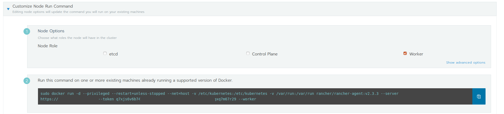

## Lab 3.3: Add Nodes

Adding a node to the existing kubernetes cluster is as easy as it was in [Lab 2.1: Provision a new Kubernetes cluster](21_provision.md)

### Add node to cluster

Open again the "Edit Cluster" page for your cluster. On the very bottom, you find `Customize Node Run Command`

Choose the Node Role you wan't to use. For this lab, we wanna add a new worker node. Copy then the docker run command and execute it on your `userX-k8snode3` node. Rancher will then deploy the worker components on the node. After some minutes, you new node will be visible and ready for your workload.

**End of Lab 3.3**

<a href="34_updatenodes.md"> 3.4 Update Nodes→</a>

[← back to the Chapter Overview](10_rancher.md)
