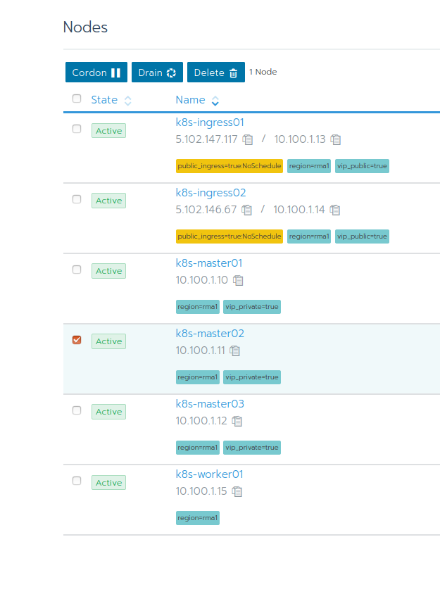

## Lab 3.4: Update Nodes

In order to update a Kubernetes node, we need to make sure that no application workload is running on this node and that Kubernetes does not schedule any new pods on this node. Afterwards, updating a node is really part of the Kubernetes daily business and should be handled by your existing processes. All Kubernetes related components (except for the container runtime) are handled by Rancher.

### Cordon a node

Cordoning a node makes it unschedulable for Kubernetes. This means that existing workload will remain running on the node, but no new pods will be scheduled there.
You can do this inside your Rancher web UI or with `kubectl`.



Select the node(s) and then click on the `Cordon` button.

With kubectl use the following command to cordon the node

```bash
kubectl cordon userX-k8snode3
```

**Note**: To use kubectl with the Kubernetes cluster first source its Kubeconfig which can be found on the cluster dashboard in the top right corner. Paste the config in a file and source it with `export KUBECONFIG=$(pwd)/kube_config_ops-techlab-cluster.yml`.

### Drain a node

By draining your node, you can remove all running pods on the selected node. Kubernetes will schedule the pods on other nodes and also does respect available [Pod Disruption Budgets](https://kubernetes.io/docs/concepts/workloads/pods/disruptions/#how-disruption-budgets-work). Assuming your workload is designed the way it should be (see [The 12-Factor App](https://12factor.net/)), there is no interruption of service expected.

```bash
kubectl drain userX-k8snode3
```

### Upgrade node

You can now upgrade your node using your existing maintance processess. 

```bash
# Example
yum update
reboot
```

### Uncordon node

Uncordoning a node makes it schedulable again for Kubernetes. You can do this inside your Rancher web UI or with kubectl.

Select the node(s) and then click on the `Uncordon` button.

With kubectl use the following command to uncordon the node

```bash
kubectl uncordon userX-k8snode3
```

**End of Lab 3.4**

<p width="100px" align="right"><a href="35_certificaterotation.md"> 3.4 Certificate Rotation →</a></p>

[← back to the Chapter Overview](10_rancher.md)
