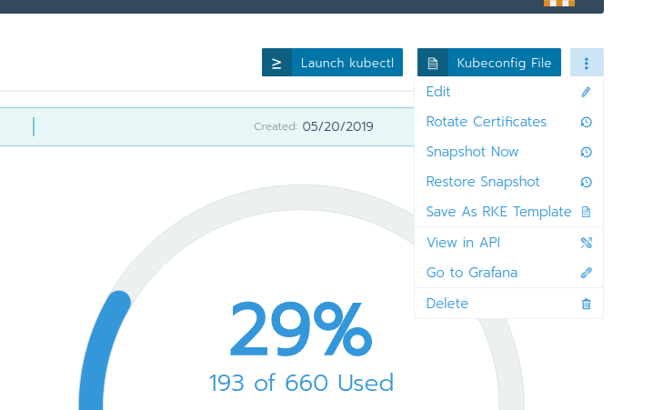
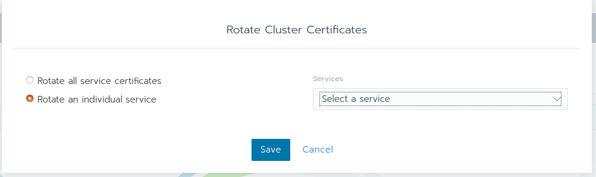

## Lab 3.5: Certificate Rotation

By default, Kubernetes clusters require certificates and Rancher launched Kubernetes clusters automatically generate certificates for the Kubernetes components. Rotating these certificates is important before the certificates expire as well as if a certificate is compromised. Check the [Rancher Documentation](https://rancher.com/docs/rancher/v2.x/en/cluster-admin/certificate-rotation/) for more details.

Certificates can be rotated for the following services:

* etcd
* kubelet
* kube-apiserver
* kube-proxy
* kube-scheduler
* kube-controller-manager

### Rotate all certificates

Rancher launched Kubernetes clusters have the ability to rotate the auto-generated certificates through the UI. You can rotate all your certificates using the Rancher Webgui.

You can decide to rotate all certificates at once or only indiviual ones.

Click on `Save` to rotate the certificates. The cluster will go into update mode, where you have to wait until it is ready again.

Be aware that after the certificates are rotated, the Kubernetes components are automatically restarted. You should do this within a maintenance window.

**End of Lab 3.5**

<a href="36_persistentstorage.md"> 3.6 Persistent Storage→</a>

[← back to the Chapter Overview](10_rancher.md)
