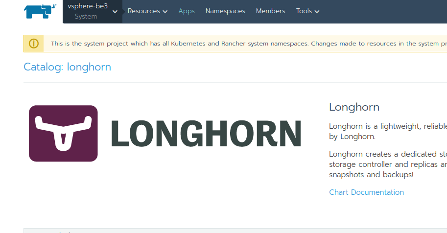
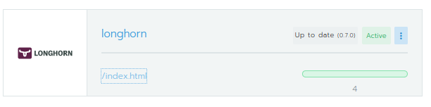
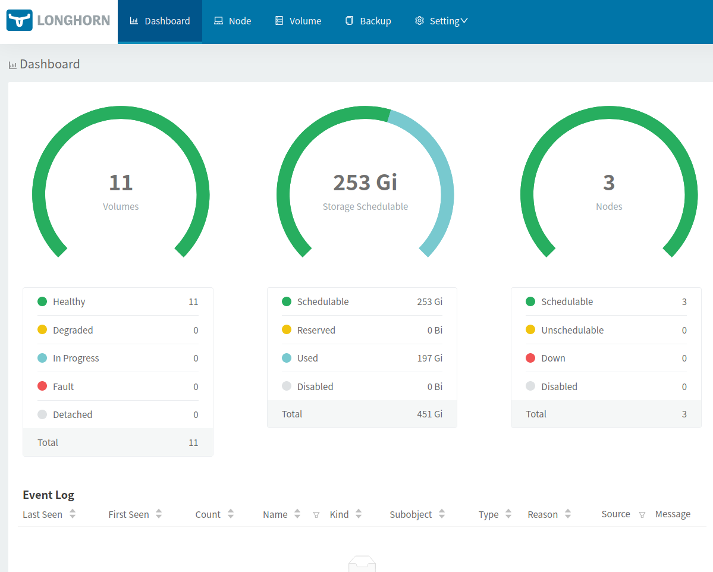
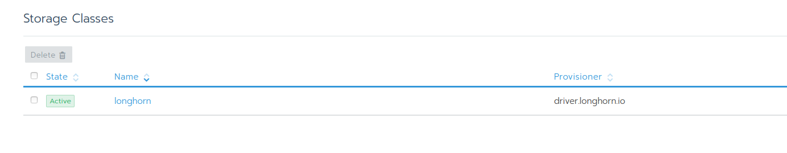
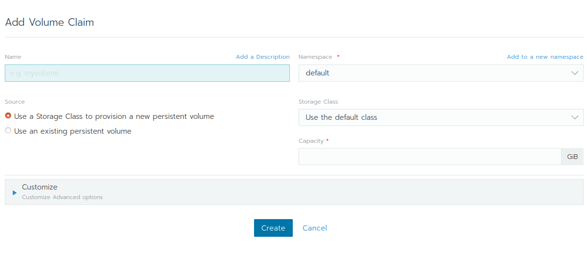
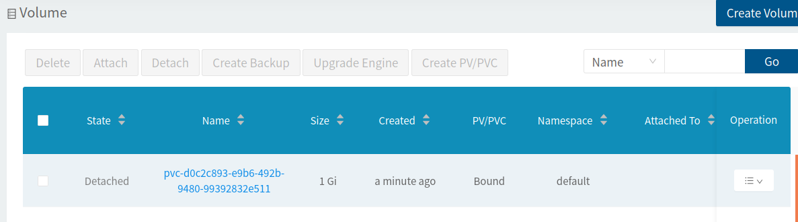
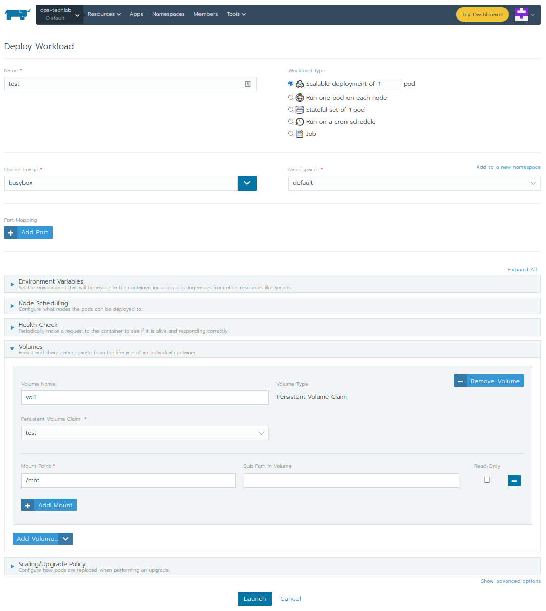
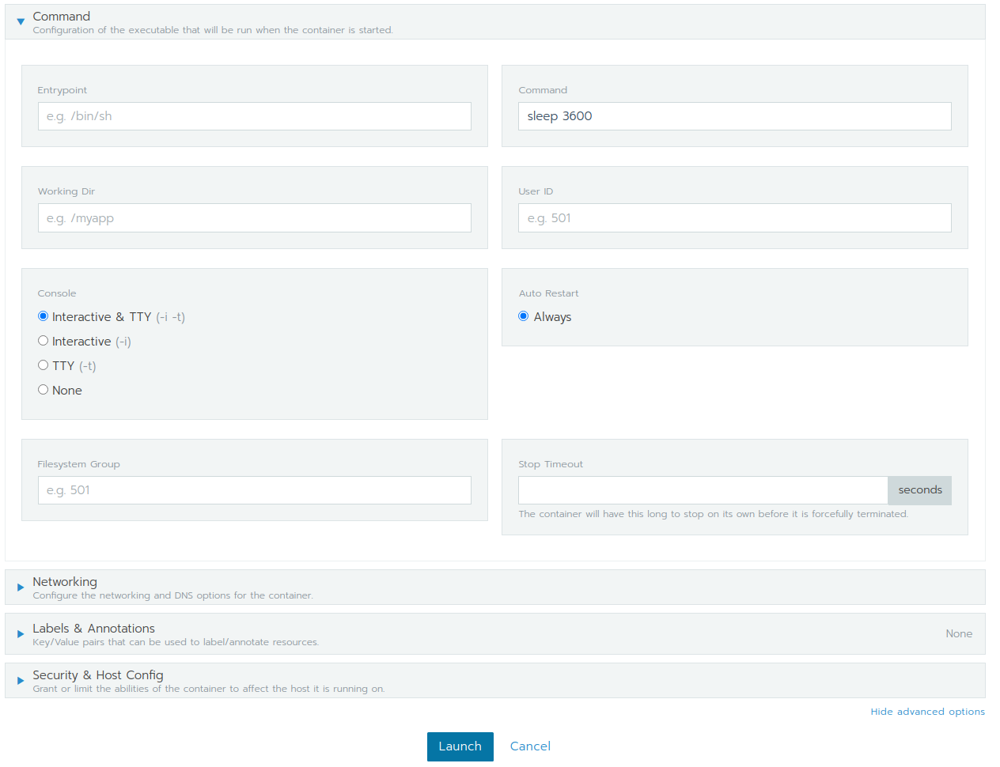
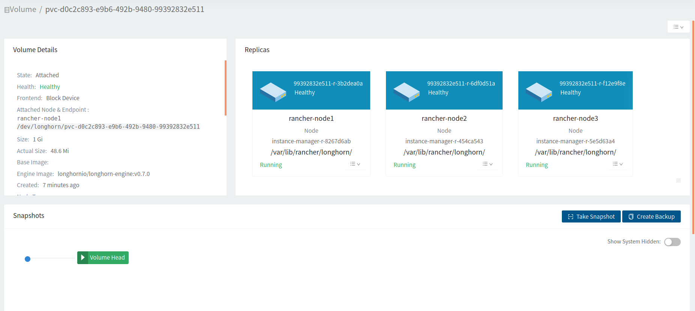

## Lab 3.6: Persistent Storage

In this lab we are going to install [Longhorn](https://github.com/longhorn/longhorn), a Cloud-Native distributed block storage. Longhorn is a [CNCF Sandbox](https://thenewstack.io/rancher-donates-its-longhorn-kubernetes-persistent-storage-software-to-cncf/) Project, we do not yet recommend this in a production setup. For this lab purpose, it's an easy solution to provide storage to your pods.


## Install Project Longhorn using Rancher App Catalog

Go to your system project and open the `Apps` page and click `Launch`. Search for Longhorn and launch a new Longhorn instance. You can leave all settings on default.



As soon as your Longhorn instance is `Active`, you can open its WebGUI, by clicking on `/index.html` to see all nodes and volumes. There should be no volume at the moment.





## Create a new Persistent Volume Claim (PVC)

Longhorn does also create a new Storage Class and marks it as the default storage class.



For testing purposes, we are going to create a new Volume. In the Rancher web UI go to the "Default" project and open the page `Resources/Workload`. Then switch to the `Volumes` tab and click on `Add Volume`.



Create a new `test` volume with 1 GiB Size. In the Longhorn web UI you should see now a new Volume which is "Detached" (as we have not yet mounted the volume in a pod):



## Mount the volume inside a pod

You can now create a new Pod and mount the volume. Create a new Deployment inside your default Namespace. Give it a name `test` and use the `busybox` container image. You can now select the already existing PVC under Volumes (`Add Volume` / `Use existing persistent volume (claim)`) and select the previously created PVC. You can mount the volume at `/mnt`. 



Before you click "Launch", you need to provide the command `sleep 3600` since the Busybox would terminate instantlly otherwise. That's because the official Busybox image uses `sh` as `CMD` and therefore does not come with a blocking `ENTRYPOINT`/`CMD` call. Click on "Show advanced options" in the bottom right corner and enter `sleep 3600` (or any other blocking command you would like to use).



Launch the Deployment and open a shell from the newly created Pod to verify the mount point (e.g. `df -h`).

```bash
/ # df -h
Filesystem                Size      Used Available Use% Mounted on
...
/dev/longhorn/pvc-6f0e9819-44e1-43d1-851d-5162eee26c82
                        975.9M      2.5M    957.4M   0% /mnt
...
```

Inside the Longhorn web UI, you should see that the volume is getting attached and as soon as it is attached you can verify all replicas for this volume.



**End of Lab 3.6**


<p width="100px" align="right"><a href="40_backuprestore.md">4 Backup and Restore→</a></p>

[← back to the Chapter Overview](10_rancher.md)
