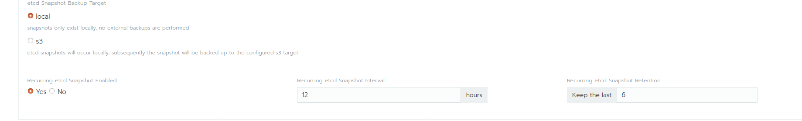
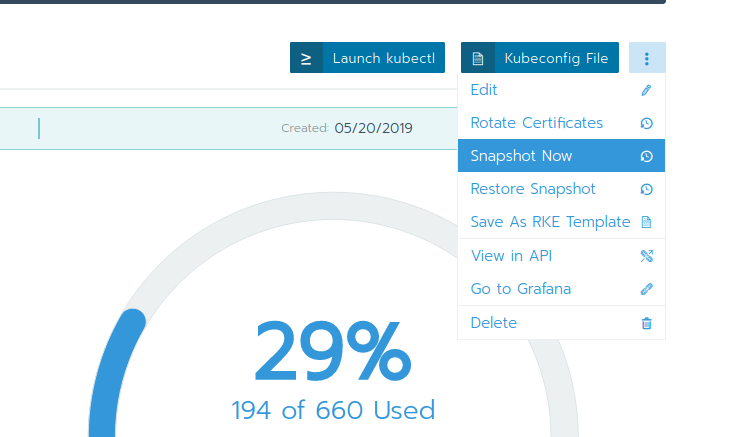
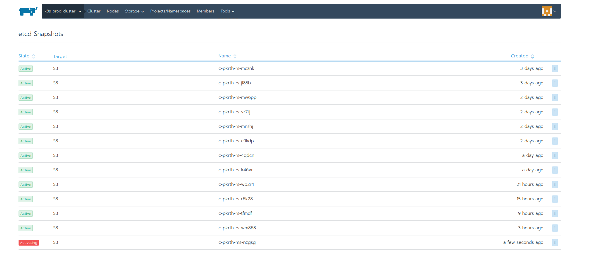

# Lab 4.3: Backing up a Rancher Launched Kubernetes Cluster

In the Rancher UI, etcd backup and recovery for Rancher launched Kubernetes clusters can be easily performed. Snapshots of the etcd database are taken and saved either locally onto the etcd nodes or to a S3 compatible target. The advantages of configuring S3 is that if all etcd nodes are lost, your snapshot is saved remotely and can be used to restore the cluster.

Rancher recommends configuring recurring etcd snapshots for all production clusters. Additionally, one-time snapshots can easily be taken as well.

Check the [Rancher documentation](https://rancher.com/docs/rancher/v2.x/en/cluster-admin/backing-up-etcd/) for more details.

## Configure recurring snapshots for the cluster

On the "Edit Cluster" Page at "Cluster Options" and "Show advanced options" you configure your recurring snapshot. As for your Rancher Control Plane Backup, this can also be a local backup, or directly uploaded to a S3 Bucket.

## One-Time Snapshots

Inside the Rancher web gui on your cluster dashboard page, you can create an new etcd Snapshot

On the "tools/Snapshot" all existing etcd snapshots are listed:

From there you can also delete existing snapshots.

**End of Lab 4.3**

---

<a href="44_restorecluster.md">4.4 Restoring Rancher Launched Kubernetes Cluster →</a>

[← back to the Labs Overview](../README.md)
