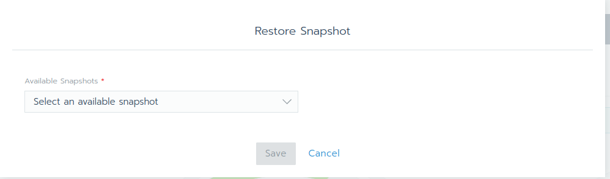

# Lab 4.4: Restoring Rancher Launched Kubernetes Cluster

etcd backup and recovery for Rancher launched Kubernetes clusters can be easily performed. Snapshots of the etcd database are taken and saved either locally onto the etcd nodes or to a S3 compatible target. The advantages of configuring S3 is that if all etcd nodes are lost, your snapshot is saved remotely and can be used to restore the cluster.

Rancher recommends enabling the ability to set up recurring snapshots of etcd, but one-time snapshots can easily be taken as well. Rancher allows restore from saved snapshots or if you don’t have any snapshots, you can still restore etcd.

Check the [Rancher documentation](https://rancher.com/docs/rancher/v2.x/en/cluster-admin/restoring-etcd/) for more details.

### Restore an etcd Snapshot

A etcd snapshot can be restored via the Rancher web gui:

---

<a href="45_backupvolumes.md">4.5 Backup Volumes →</a>

[← back to the Labs Overview](../README.md)
