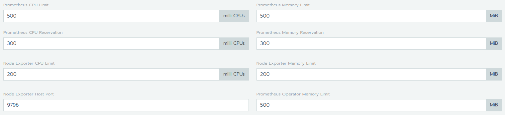
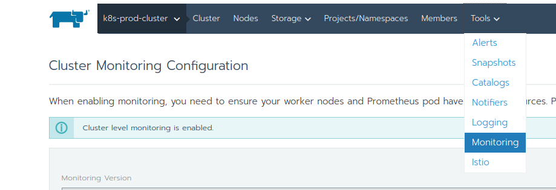
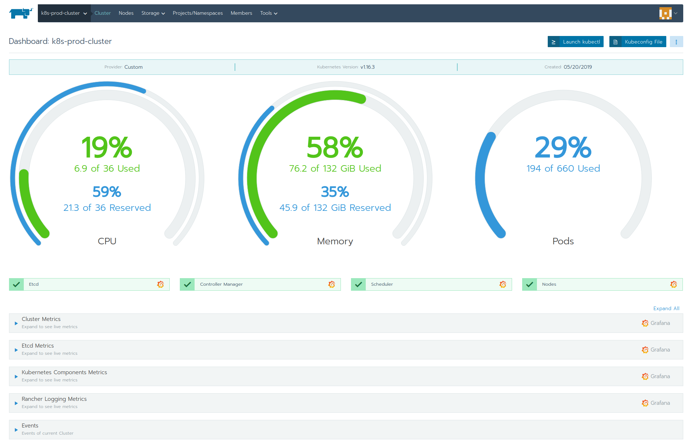
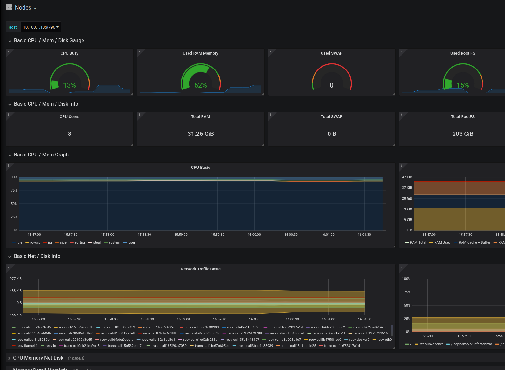

# Lab 5.1: Rancher Cluster Monitoring

Using Rancher, you can monitor the state and processes of your cluster nodes, Kubernetes components, and software deployments through integration with [Prometheus](https://prometheus.io/), a leading open-source monitoring solution.

Prometheus provides a time series of your data, which is, according to Prometheus documentation:

```A stream of timestamped values belonging to the same metric and the same set of labeled dimensions, along with comprehensive statistics and metrics of the monitored cluster.```

Using Prometheus, you can monitor Rancher at both the cluster level and project level. For each cluster and project that is enabled for monitoring, Rancher deploys a Prometheus server.

* Cluster monitoring allows you to view the health of your Kubernetes cluster. Prometheus collects metrics from the cluster components below, which you can view in graphs and charts.
    * Kubernetes control plane
    * etcd database
    * All nodes (including workers)


Check the [Rancher Documentation](https://rancher.com/docs/rancher/v2.x/en/cluster-admin/tools/monitoring/) for more details.


## Enable Cluster Monitoring

As an administrator or cluster owner, you can configure Rancher to deploy Prometheus to monitor your Kubernetes cluster.

* From the Global view, navigate to the cluster that you want to configure cluster monitoring.
* Select "Tools" > "Monitoring" in the navigation bar. 
* Review the resource consumption recommendations to ensure you have enough resources for Prometheus and on your worker nodes to enable monitoring. Choose CPU and memory limits more alligned with to the official guideline (Prometheus: reservation 300, limit 500): https://rancher.com/docs/rancher/v2.x/en/cluster-admin/tools/monitoring/#resource-consumption



* Select "Enable" to save and apply your configuration.



As soon as all component for the cluster monitoring are deployed you can the metrics through your cluster dashboard by clicking on the small Grafana logos.



Right after your initial Deployment of the cluster monitoring, you don't have much data in your Prometheus. Come back to the Grafana dashboards after some minutes and explore them.



**End of Lab 5.1**

---

<p width="100px" align="right"><a href="52_projectmonitoring.md">5.2 Rancher Project Monitoring →</a></p>

[← back to the Labs Overview](../README.md)
