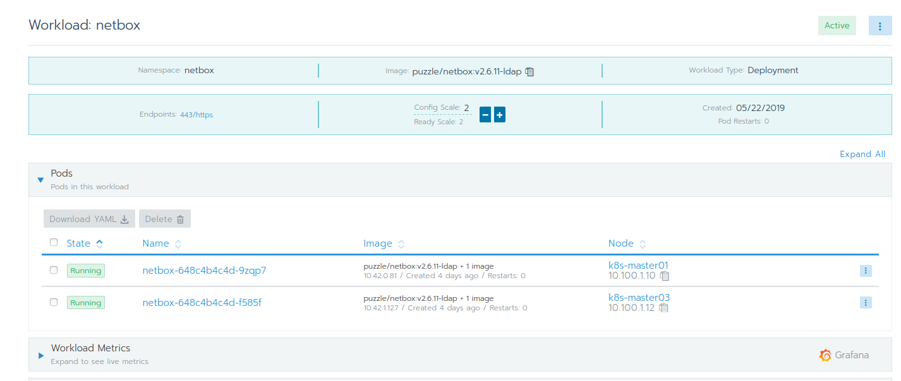
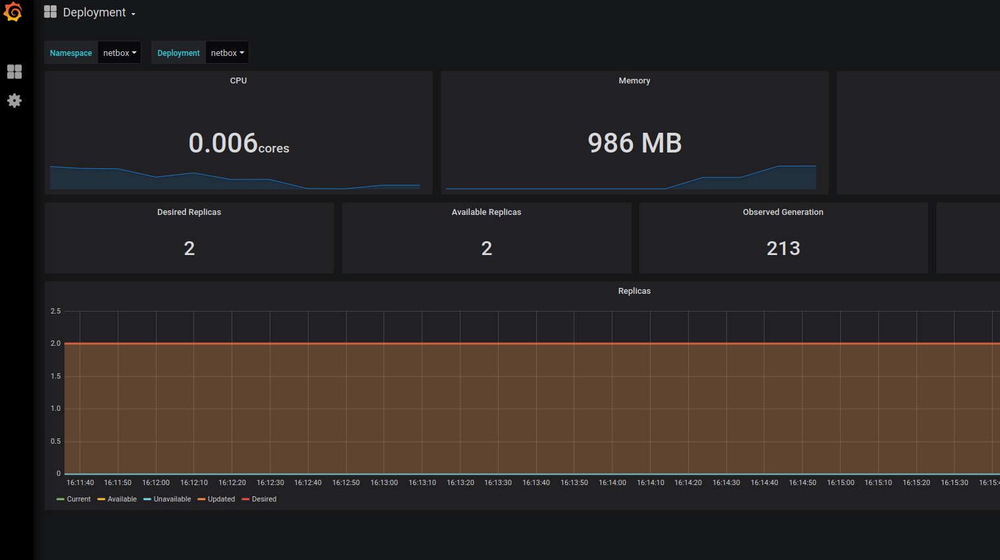

# Lab 5.2: Rancher Project Monitoring

Project monitoring allows you to view the state of pods running in a given project. Prometheus collects metrics from the project’s deployed HTTP and TCP/UDP workloads.

Check the [Rancher Documentation](https://rancher.com/docs/rancher/v2.x/en/project-admin/tools/monitoring/) for more details.

## Enable Project Monitoring

Only administrators, cluster owners or members, or project owners can configure project level monitoring. Project members can only view monitoring metrics.

* From the Global view, navigate to the project that you want to configure project monitoring.
* Select Tools > Monitoring in the navigation bar.
* Select Enable to show the Prometheus configuration options. Enter in your desired configuration options.
* Click Save.

When all components of the project monitoring are deployed, you can open the workload metrics by clicking on the grafana icon within your Workload view.

Rancher does deploy multiple Grafana Dashboards. Open Grafana and explore whats available

**End of Lab 5.2**

---

<a href="53_logging.md">5.3 Logging →</a>

[← back to the Labs Overview](../README.md)
