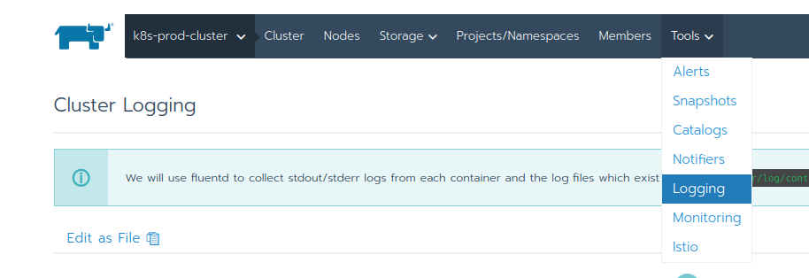

# Lab 5.3: Logging

Logging is helpful because it allows you to:

* Capture and analyze the state of your cluster
* Look for trends in your environment
* Save your logs to a safe location outside of your cluster
* Stay informed of events like a container crashing, a pod eviction, or a node dying
* More easily debug and troubleshoot problems

Rancher supports integration with the following services:

* Elasticsearch
* Splunk
* Kafka
* Syslog
* Fluentd

Rancher can integrate with popular external services used for event streams, telemetry, or search. These services can log errors and warnings in your Kubernetes infrastructure to a stream.

These services collect container log events, which are saved to the /var/log/containers directory on each of your nodes. The service collects both standard and error events. You can then log into your services to review the events collected, leveraging each service’s unique features.

When configuring Rancher to integrate with these services, you’ll have to point Rancher toward the service’s endpoint and provide authentication information.

Additionally, you’ll have the opportunity to enter key-value pairs to filter the log events collected. The service will only collect events for containers marked with your configured key-value pairs.

You can configure logging at either cluster level or project level.

* Cluster logging writes logs for every pod in the cluster, i.e. in all the projects. For RKE clusters, it also writes logs for all the Kubernetes system components.
* Project logging writes logs for every pod in that particular project.

See the [Rancher documentation](https://rancher.com/docs/rancher/v2.x/en/cluster-admin/tools/logging/) for more details.

## Enable Cluster Logging

As we don't have any suitable destination for the logs in this lab setup, we are not going to enable the logging.

Rancher Cluster (or Project) Logging can be enabled via "Tools/Logging"

**End of Lab 5.3**

---

<a href="60_appcatalog.md">6 App Catalog →</a>

[← back to the Labs Overview](../README.md)
