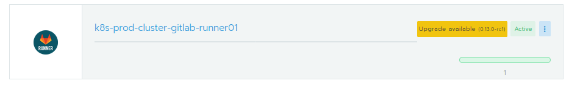

# Lab 6.2: Upgrade an App

Upgrading an App in the Rancher App Catalog is as easy as installing a new Upp.

## Upgrade an app

The Rancher WebGui does show you all Apps which can be upgraded.

You can then click on the Yellow Button with the "Upgrade available" Message. Verify all values for the App (change if needed) and apply it. Rancher does then upgrade the app. As always, verify Changelog of the App to see what changed and if there are tasks to perform befor or after upgrading. Rancher App Catalog does only apply the new chart version and is not application aware!
---

<a href="63_helmcharts.md">6.3 Use your own Helm Charts →</a>

[← back to the Labs Overview](../README.md)
