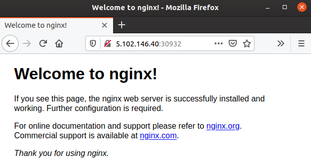

# Lab 6.4: Manage your Rancher Chart

## Install the Chart

Now it is possible to install the helm chart directly from the directory on the `userX-controller` VM. Because we have added that question we also need to provide a value for it. That's why we pass `--set deploymenttitle=foobar` as an argument to the chart.
```bash
$ helm install example ./mychart --set service.type=NodePort --set deploymenttitle=foobar
NAME: example
LAST DEPLOYED: Wed Feb 12 13:51:32 2020
NAMESPACE: default
STATUS: deployed
REVISION: 1
NOTES:
1. Get the application URL by running these commands:
  export NODE_PORT=$(kubectl get --namespace default -o jsonpath="{.spec.ports[0].nodePort}" services example-mychart)
  export NODE_IP=$(kubectl get nodes --namespace default -o jsonpath="{.items[0].status.addresses[0].address}")
  echo http://$NODE_IP:$NODE_PORT
```

Run the 3 commands that were promted by the `helm install` command to get the URL to the service.

```bash
$ export NODE_PORT=$(kubectl get --namespace default -o jsonpath="{.spec.ports[0].nodePort}" services example-mychart)
$ export NODE_IP=$(kubectl get nodes --namespace default -o jsonpath="{.items[0].status.addresses[0].address}")
$ echo http://$NODE_IP:$NODE_PORT
http://5.102.146.40:30932
```

If everything works fine a nginx server will be available under the listed URL `http://5.102.146.40:30932`.



If we now have a look in the Rancher UI and navigate to our clusters default Namespace, we see that a new Deployment called `foobar` has been created.

## List installed Charts
We can see the installed Charts in our current Namespace. To show installed Helm charts from another Namespaces specify the Namespace with `-n <namespace>`.
```bash
$ helm list
NAME   	NAMESPACE	REVISION	UPDATED                                	STATUS  	CHART        	APP VERSION
example	default  	1       	2020-02-12 14:59:36.998911494 +0100 CET	deployed	mychart-0.1.0	1.16.0
```

## Delete our installed Chart
```bash
$ helm uninstall example
release "example" uninstalled
```

## Further reading
* https://docs.bitnami.com/kubernetes/how-to/create-your-first-helm-chart/
* https://rancher.com/docs/rancher/v2.x/en/catalog/custom/creating/

---

<p width="100px" align="right"><a href="65_sharehelmcharts.md">6.5 Share the Chart →</a></p>

[← back to the Labs Overview](../README.md)