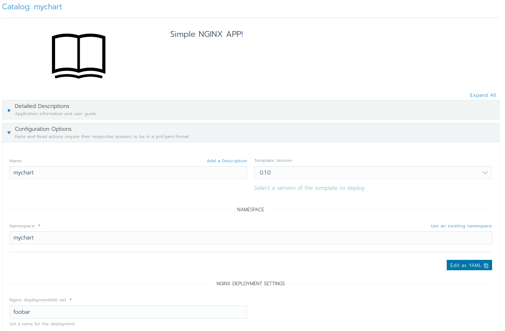

# Lab 6.5: Share your own Rancher Charts

## Packing it up to share (tar)
In order to share our helm charts we can also pack them together in `tar` archive. This makes it much easier to share it and for others to install.

```bash
$ helm package ./mychart
Successfully packaged chart and saved it to: /home/ansible/techlab/mychart-0.1.0.tgz
```

We don't do that now but we than could also install the chart from this tar archive.
```bash
$ helm install example mychart-0.1.0.tgz --set service.type=NodePort --set deploymenttitle=foobar
```

## Share it with git

There acutally is a much simpler way to share your custom helm/rancher charts. It is possible to add it to github and install it from there.

1. Initialize a new git repository inside the mychart chart.
    ```bash
    $ git init
    ```
2. Set the username and email for the git configuration.
    ```bash
    $ git config --global user.email "you@example.com"
    $ git config --global user.name "Your Name"
    ```
3. Set track for all files.
    ```bash
    $ git add --all
    ```
4. Commit all changes and push it to github.
    ```bash
    $ git commit -m "Initial commit"
    $ git push origin master -f
    ```

## Add the custom chart

Add the github repo which contains the catalog.
Add the catalog to rancher.

Global -> Tools -> Catalog -> Add Catalog.
* **Name**: github-mychart
* **Catalog Url**: \<github url\>

Now we are be able to deploy the our `mychart` Chart directly from our github repository.

Go to _Cluster ops-techlab -> Default namespace -> Apps -> Launch_. If you see your own Chart from Github here all is working and we can deploy it.


So we can create a Deployment of our `mychart` Chart and provide our question.



---

[← back to the Labs Overview](../README.md)